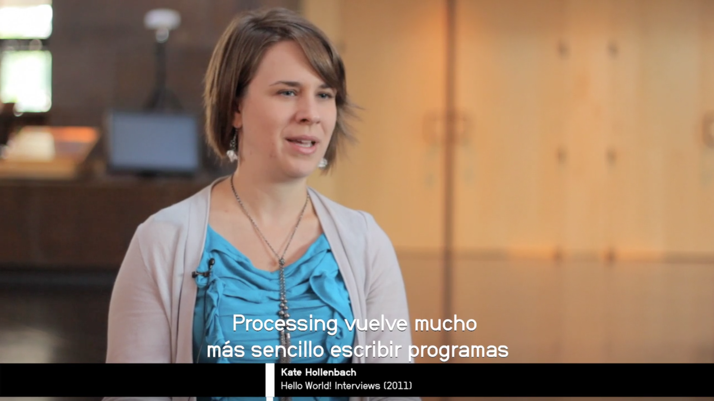

# Introduction-To-Programming (WORK IN PROGRESS)

  

1. Crear cuentas 
OpenProcessing https://www.openprocessing.org/user/65585/
Editor p5 https://editor.p5js.org/

2. Primitivas

3. Eventos

4. Contadores Limite
https://www.openprocessing.org/sketch/625197

4. Contadores rebote

4. For loop

4.1. Nested for loop

LINKS
http://keycode.info/

***
### Processing Bibliography
- [Getting Started with Processing: A Hands-On Introduction to Making Interactive Graphics](https://www.amazon.com/Getting-Started-Processing-Hands-Introduction/dp/1457187086/ref=sr_1_1?s=books&ie=UTF8&qid=1517548151&sr=1-1&keywords=getting+started+with+processing)
- [Learning Processing Second Edition, Shiffman (2015) Online version](http://learningprocessing.com/examples/)
- [Nature of Code, Shiffman (2012) Online version](http://natureofcode.com/book/)
- [A Study Path For Game Programmer, Yip (2016)](https://github.com/miloyip/game-programmer)
- [But what is the Fourier Transform? A visual introduction, 3Blue1Brown (2018)](https://www.youtube.com/watch?v=spUNpyF58BY)
- [15 Sorting Algorithms in 6 Minutes](https://www.youtube.com/watch?v=kPRA0W1kECg)
- [Rose (mathematics)](https://en.wikipedia.org/wiki/Rose_(mathematics))
- [Poetic Computation](http://poeticcomputation.info/)

### p5 Links:
- [p5Live Tutorial] (https://www.youtube.com/watch?v=bF8ybSVDUKM&feature=youtu.be&fbclid=IwAR1f4OcEPTfl-Jp2omsYOlIV8t-SnUkE2sjwmynyQ1WLQwhiogPQxYkoIAk)

### Processing Links:
- [Teaching Tim Roden Broeker](https://teaching.timrodenbroeker.de/)
- [Processing Workshops](https://code.artsnum.be/)
- [Download Processing](https://processing.org/download/)
- [Processing Reference](https://processing.org/reference/)
- [The Coding Train (Daniel Shiffman)](https://www.youtube.com/user/shiffman)
- [Hello Processing](http://hello.processing.org/)
- [Hello p5js](http://hello.p5js.org/)
- [Online Editor p5js](http://alpha.editor.p5js.org/)
- [OpenProcessing](https://www.openprocessing.org/)
- [Processing Foundation](https://processingfoundation.org/)
- [Collision Detection for Processing](http://www.jeffreythompson.org/collision-detection/)
- [Hello World! Processing - Documentary](https://vimeo.com/60731302)
- [Processing for Raspberry Pi](https://www.raspberrypi.org/blog/now-available-for-download-processing/)
- [Google Java Style Guide](https://google.github.io/styleguide/javaguide.html)
- [Recode Project](http://recodeproject.com/)
- [Algorithmic Art and Trigonometric Design - Mahesh Raghvan](http://maheshraghvan.com/sinexplosion.html)
- [The History of Processing by Casey Reas and Ben Fry](https://medium.com/@ProcessingOrg/a-modern-prometheus-59aed94abe85)
- [Tinkercad Circuits](https://www.tinkercad.com/circuits)

### Color Palettes:
- [Adobe Color](https://color.adobe.com/)
- [Coolors](https://coolors.co/)
- [CSS Colors - w3schools](https://www.w3schools.com/cssref/css_colors.asp)
- [Colors Tutorial - w3schools](https://www.w3schools.com/colors/default.asp)
- [Paletton](http://paletton.com/)
- [thi.ng/color, Karsten Schmidt](https://github.com/thi-ng/color)

### Example Sketches - Juan Olaya
For more examples, visit [OpenProcessing - Juan Olaya](https://www.openprocessing.org/user/65585/)

  

***
